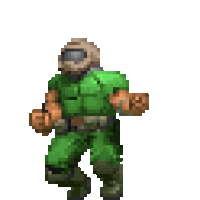

# Profile

Hello, I'm @Ender1805. I am an amateur programmer with some experience.

I started programming out of curiosity and never stopped since. I mainly use C# for most projects, but I am also interested in other languages as well. I mostly program video games that run on Windows, Linux and Android. However, I also program other utilities that run on the same systems to simplify some tasks or replace stuff I don't like.

*Me when I finally fixed my code that didn't work for some reason*

Please only send private messages if it's related to a project I work on. Don't try to contact me for anything else.
